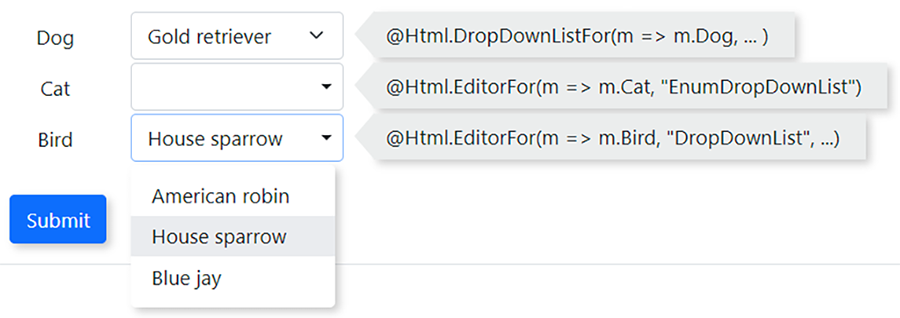

Bootstrap 5 DropDown in .Net Mvc
================================
***The Editor Template Approach***

Do you feel irritating after almost 3 decades of development by the trillion dallor tech industry, you still can't style the dropdown list like everything else in your page? The elegant @Html.DropDownListFor(...) produces a ugly widget doesn't fit in your design aesthetically. Bootstrap has been living with .Net since the early days, somehow it seems @Html.DropDownListFor(...) doesn't know its existence. 

[](./blobs/sc02.png)

Copying the example of the dropdown from Bootsrap website to your cshtml view? It's not doing it's supposed to do: display the selected value, and add the value to the form being posted to the backend. What is going on?

I blame W3C. They leave the select/option elements the way it is, Google, Microsoft or Twitter are not suppoed to step on W3C's toes.

I spent my weekend to incorporate the Bootstrap dropdown into .Net web applications. It turns out, a few css blocks wouldn't do. You need css, Javascript and extra C# code to make it work. Some people posted HtmlHelper extensions code on StackOverflow to generate Bootstrap dropdown elements, but in my opinion, given the flexibility of the Bootsrap dropdown, editor template serves the purpose better.

I wrote 2 templates, one for (string, object) tuple list (I hate SelectionListItem so didn't use it), one for enum values. The latter is my favorite, since it handles both enum value and its nullable counterpart, ***implicitly***. 

Supposely you have an enum property Choice in your model, you can create the Bootstrap list by:
```C#
@Html.EditorFor(m => m.Choice, "EnumDropDownList", new { @class = "form-control" })
```
That's it, the template will figure out everything else for you. It automatically adds a blank option if the property is nullable.

You do need the supporting code though. The EnumExtensions, copy the class or incorporate the method GetDisplayName to your own enum extensions:
```C#
public static class EnumExtensions
{
    public static string? GetDisplayName(this Type type, object value)
    {
        if (type.IsEnum)
        {
            var name = type.GetEnumName(value);
            if (name != null)
            {
                var member = type.GetMember(name);
                if (member.Length > 0)
                {
                    var display = member[0].GetCustomAttribute<DisplayAttribute>();
                    if (display != null)
                        return display.Name;
                    return member[0].Name;
                }
            }
        }
        return null;	
    }
}
```
The following css will make the dropdown looks like Bootstrap form-select:
```css
.form-control {
    min-width: 10em;
}
.dropdown-item {
    min-height: 1.75rem;
}
.dropdown-toggle.form-control {
    position: relative;
    text-align: left;
    min-height: 2.375em;
}
.dropdown-toggle.form-control::after {
    position:absolute;
    top: 1em;
    right: 0.5em;
}
```
The last but not least, copy the dropdown click event handler Javascript from site.js to your own library:

```javascript
$(".dropdown-toggle").next(".dropdown-menu").children().on("click", function () {
    const menu = $(this).closest(".dropdown-menu");
    const button = menu.prev(".dropdown-toggle");
    button.text($(this).text());
    const input = button.prev("input[type='hidden']");
    input.val($(this).attr('value'));
});
```
 If you are not rendering the scripts at the end of the page (the bottom of your _Layout.cshtml), you need to wrap it in the document ready event handler. 
 
 Here you have it, style the dropdown anyway you like.

 [](./blobs/sc01.png)